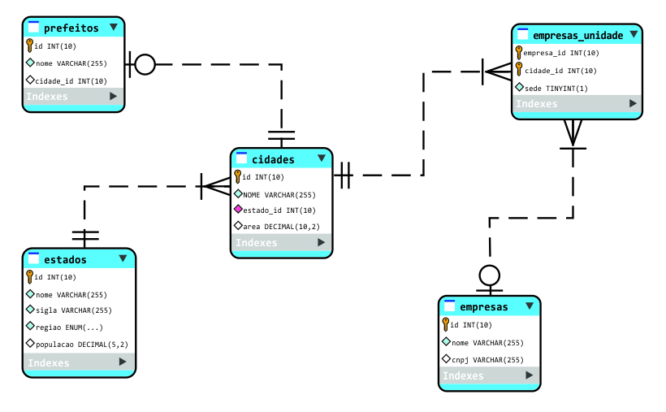
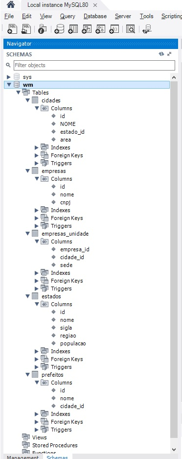

#  Módulo de SQL do curso [Java 2022 completo](https://www.udemy.com/course/fundamentos-de-programacao-com-java/) (plataforma [Udemy](https://www.udemy.com/course/fundamentos-de-programacao-com-java/))
Nesse módulo do curso foi feita uma apresentação concisa, mas bem completa dos fundamentos de um **Banco de Dados relacional**, com apresentação de conceitos como entidade/relacionamento e operações de CRUD e SQL.
Durante os estudos, eu

- [x] criei um Schema com suas tabelas
- [x] executei operações de consulta,
- [x] criei relacionamentos,
- [x] executei comandos de update, insert, delete, joins.
- [x] simulei uma consulta "full join" no MySQL usando o "union"

Usei o MySQL Server para o serviço de banco de dados e o Workbench para visualização e também alguns comandos.
Fiz os exercícios (e arquivos .sql) com o VS Code e o plugin vs-code database para codar e rodar os comandos SQL.

Associei esse aprendizado com as informações da disciplina Modelagem de Dados que estou estudando esse período na graduação Ciência da Computação. Tenho por objetivo praticar mais a partir desse começo para consolidar o conhecimento.

Nos exercícios, não foi exigido um relacionamento obrigatório da tabela prefeitos com a tabela cidades, e também não foi obrigatório da tabela cidades com a tabela prefeitos, conforme DER.

O arquivo [sequencia-de-eventos.md](./sequencia-de-eventos.md) apresenta a sequência em que os exercícios foram feitos, bem como a ordem de codagem dos arquivos.

Visualização no painel SCHEMAS do Workbench:

